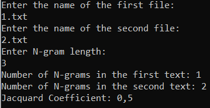

# Измерение сходства текстов с помощью коэффициента Жаккара

В данном проекте реализована консольная программа, которая измеряет сходство двух текстов, подсчитывая коэффициент Жаккара по множествам N-грамм. 
N-граммы представляют собой последовательности из N слов, приведенных к нижнему регистру. Программа принимает два текстовых файла из папки Texts и размер N-грамм в качестве аргументов командной строки.

## Описание

### N-граммы

N-граммой называется последовательность из N слов. В данной реализации считается, что N-грамма встречается в тексте, если все ее слова идут последовательно друг за другом в одном предложении. Предложения разделяются следующими символами: `.`, `!`, `?`, `(`, `)`, `[`, `]`, `{`, `}`.

### Коэффициент Жаккара

Коэффициент Жаккара определяется следующим образом:
 

- **freq(g,T)**: — это количество вхождений граммы g в текст T
- **common(T1, T2)**: 
$$
\sum_{g \in G} \min(freq(g, T_1), freq(g, T_2))
$$
.
- **total(T1, T2)**: 
$$
\sum_{g \in G} \max(freq(g, T_1), freq(g, T_2))
$$
- **J(T1, T2)**: common(T1, T2)/total(T1, T2).

При вычислении common и common учитываются только те N-граммы, которые присутствуют в обоих текстах

## Пример работы
Пример работы программы, когда:
- первый файл содержит текст a b c. a b c
- второй файл содержит текст a b c! x y z
- длинна N-грамм 

